# `IETS_RT_Dispatch`-论文调研

## 创新点

- ADP
  - [近似动态规划到底是什么？](https://www.zhihu.com/question/28728363)
  - [从动态规划到近似动态规划：BERTSEKAS 2014 在THU的暑期课程笔记](https://zhuanlan.zhihu.com/p/58837258)
  - [近似动态规划和强化学习 - ADP&RL](https://blog.csdn.net/qq_37266917/category_11441003.html)
- IL(Imitation Learning)
  - [模仿学习简洁教程](https://www.lamda.nju.edu.cn/xut/Imitation_Learning.pdf)

## 目标

`IETS`实时调度问题的目标是设计一个调度策略以最小化操作成本：

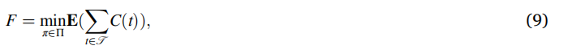

## 解决方案

>  ADP+IL

### 3.1 DP

#### **1 外部信息**

`IETS`的外部信息包括：`RES`的生成的随机过程、环境温度、电热负载、实时价格。

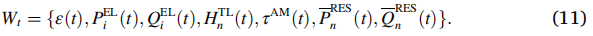

*备注：*

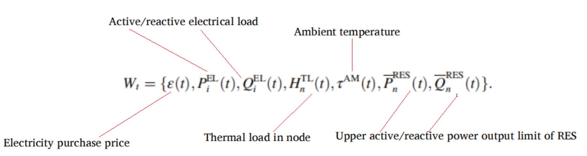

#### **2 系统状态**

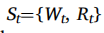

- 外部信息
- 资源状态

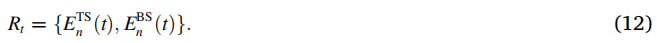

*备注：*

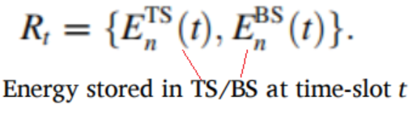

#### **3 决策变量**

*备注：*

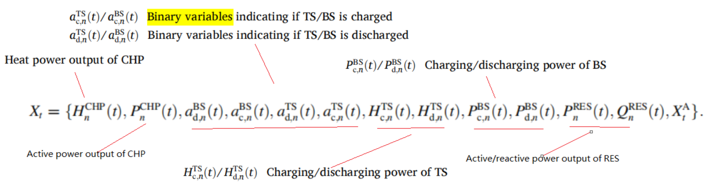

$X_t^A$​表示：`optimal energy flows in IETS, e.g., mass flow rates and flow temperature of TDN, voltages and branch flows of EDN`

#### **4 状态转移**

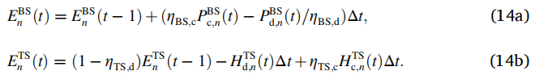

*备注：*

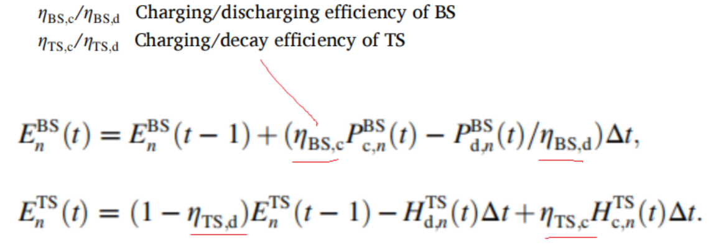

寻找最优策略：

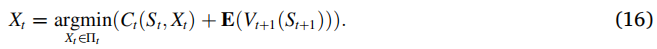

*备注：*

- [贝尔曼方程](https://zh.wikipedia.org/zh-hans/%E8%B2%9D%E7%88%BE%E6%9B%BC%E6%96%B9%E7%A8%8B)：又叫动态规划方程，是以`Richard Bellman`命名的，表示动态规划问题中相邻状态关系的方程。某些决策问题可以按照时间或空间分成多个阶段，每个阶段做出决策从而使整个过程取得效果最优的多阶段决策问题，可以用动态规划方法求解。某一阶段最优决策的问题，通过贝尔曼方程转化为下一阶段最优决策的子问题，从而初始状态的最优决策可以由终状态的最优决策(一般易解)问题逐步迭代求解。存在某种形式的贝尔曼方程，是动态规划方法能得到最优解的必要条件。绝大多数可以用最优控制理论解决的问题，都可以通过构造合适的贝尔曼方程来求解。

### 3.2 monotone-ADP

加速计算：

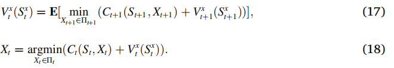

最终的`MILP`：

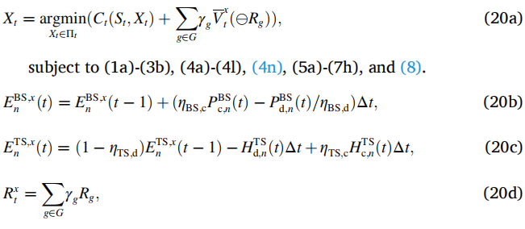

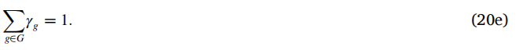

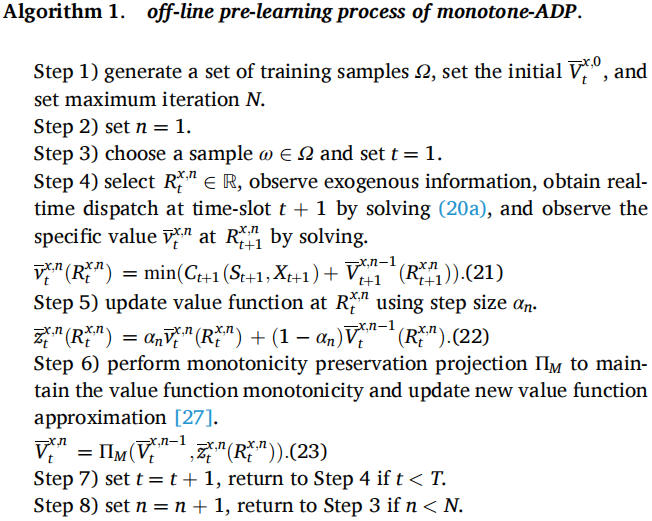

### 3.3. ADP-IL

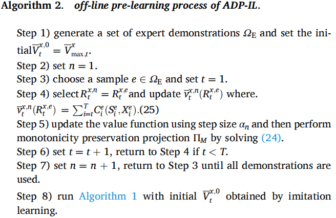

### 3.4. ADP-IL based real-time IETS dispatch

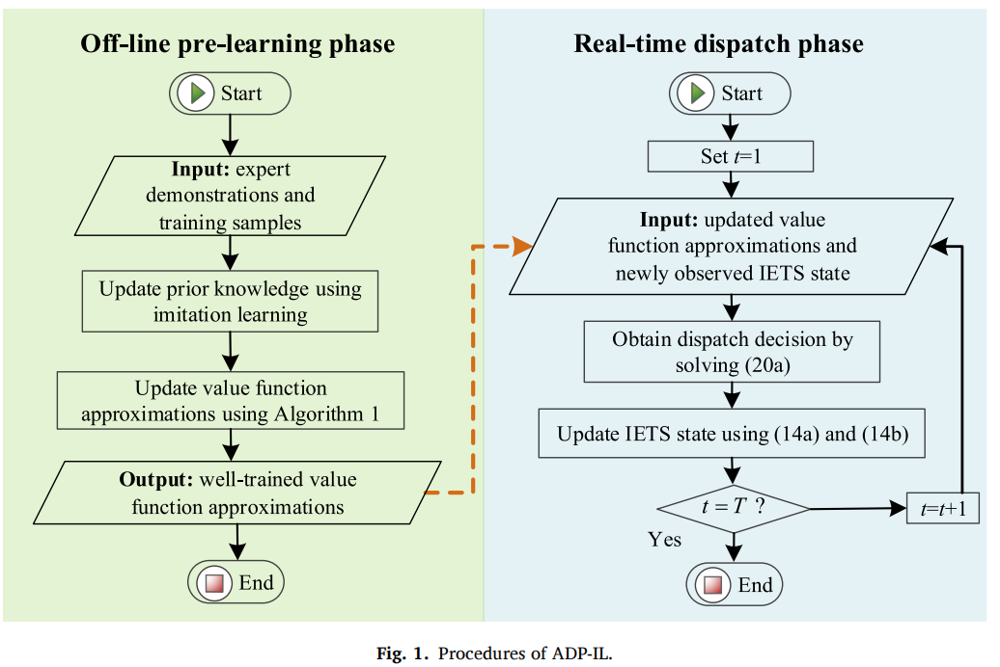

### **Nomenclature**

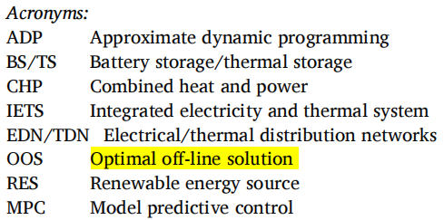